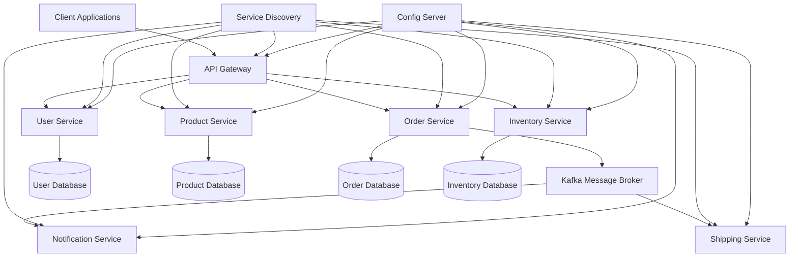

# 🚀 Smart Order Management System (SOMS)

> A comprehensive microservices-based e-commerce order management platform built with Spring Boot, demonstrating enterprise-grade architecture patterns and real-time communication.

[](https://openjdk.java.net/projects/jdk/17/)
[](https://spring.io/projects/spring-boot)
[](https://kafka.apache.org/)
[](https://www.docker.com/)
[](LICENSE)

## 📋 Table of Contents

- [🎯 Project Overview](#-project-overview)
- [🏗️ Architecture](#️-architecture)
- [🧩 Microservices](#-microservices)
- [🔄 Data Flow](#-data-flow)
- [🛠️ Technology Stack](#️-technology-stack)
- [🚀 Quick Start](#-quick-start)
- [📁 Project Structure](#-project-structure)
- [🔧 Configuration](#-configuration)
- [🔐 Authentication & Security](#-authentication--security)
- [📊 Monitoring & Observability](#-monitoring--observability)
- [🧪 Testing Strategy](#-testing-strategy)
- [🔄 CI/CD Pipeline](#-cicd-pipeline)
- [📚 API Documentation](#-api-documentation)
- [🎨 Frontend Integration](#-frontend-integration)
- [🔍 Troubleshooting](#-troubleshooting)
- [🤝 Contributing](#-contributing)

## 🎯 Project Overview

The Smart Order Management System (SOMS) is a production-ready microservices application that simulates a real-world e-commerce order processing system. It demonstrates modern enterprise architecture patterns including:

- **Event-Driven Architecture** with Apache Kafka
- **Microservices Communication** patterns
- **Distributed System Resilience** with circuit breakers
- **Real-time Notifications** and order tracking
- **Scalable Authentication** with JWT tokens
- **Observability** with distributed tracing

### 🎪 Key Features

- ✅ **Real-time Order Processing** - Instant order validation and processing
- ✅ **Inventory Management** - Automatic stock updates and availability checks
- ✅ **Event-Driven Notifications** - Asynchronous email/SMS notifications
- ✅ **Order Tracking** - Real-time shipment status updates
- ✅ **User Management** - Secure authentication with role-based access
- ✅ **Admin Dashboard** - Comprehensive system monitoring
- ✅ **API Gateway** - Centralized request routing and security
- ✅ **Service Discovery** - Dynamic service registration and discovery

## 🏗️ Architecture

### System Architecture Diagram



### 🔄 Request Flow

1. **Client Request** → API Gateway
2. **Authentication** → User Service validates JWT
3. **Service Discovery** → Eureka resolves service locations
4. **Business Logic** → Appropriate microservice processes request
5. **Event Publishing** → Kafka handles async communications
6. **Response** → Gateway returns consolidated response

## 🧩 Microservices

### 1. 🚪 API Gateway Service
**Port**: `8080`

The central entry point for all client requests, providing:

- **Request Routing** - Intelligent routing to appropriate microservices
- **Authentication** - JWT token validation
- **Rate Limiting** - Prevents API abuse
- **Load Balancing** - Distributes requests across service instances
- **CORS Handling** - Cross-origin request management

**Key Dependencies:**
```xml
<dependency>
    <groupId>org.springframework.cloud</groupId>
    <artifactId>spring-cloud-starter-gateway</artifactId>
</dependency>
<dependency>
    <groupId>org.springframework.cloud</groupId>
    <artifactId>spring-cloud-starter-netflix-eureka-client</artifactId>
</dependency>
```

### 2. 👤 User Service
**Port**: `8081`

Manages user authentication and authorization:

- **User Registration** - Account creation with validation
- **Authentication** - Login with JWT token generation
- **Authorization** - Role-based access control (RBAC)
- **Profile Management** - User profile CRUD operations
- **Password Security** - BCrypt encryption

**Endpoints:**
- `POST /api/users/register` - User registration
- `POST /api/users/login` - User authentication
- `GET /api/users/profile` - Get user profile
- `PUT /api/users/profile` - Update user profile

### 3. 📦 Product Service
**Port**: `8082`

Handles product catalog management:

- **Product CRUD** - Create, read, update, delete products
- **Category Management** - Product categorization
- **Search & Filtering** - Advanced product search
- **Price Management** - Dynamic pricing support
- **Image Handling** - Product image management

**Endpoints:**
- `GET /api/products` - List products with pagination
- `GET /api/products/{id}` - Get product details
- `POST /api/products` - Create new product (Admin only)
- `PUT /api/products/{id}` - Update product (Admin only)
- `DELETE /api/products/{id}` - Delete product (Admin only)

### 4. 🛒 Order Service
**Port**: `8083`

Core order processing functionality:

- **Order Creation** - Multi-step order validation
- **Order Lifecycle** - Status management (PENDING → CONFIRMED → SHIPPED → DELIVERED)
- **Payment Integration** - Payment processing coordination
- **Order History** - User order tracking
- **Cancellation Logic** - Order cancellation with inventory rollback

**Order States:**
```java
public enum OrderStatus {
    PENDING,     // Order created, awaiting validation
    CONFIRMED,   // Inventory reserved, payment processed
    SHIPPED,     // Order dispatched
    DELIVERED,   // Order completed
    CANCELLED    // Order cancelled
}
```

### 5. 📊 Inventory Service
**Port**: `8084`

Real-time inventory management:

- **Stock Tracking** - Real-time inventory levels
- **Reservation System** - Temporary stock holds during order processing
- **Automatic Updates** - Stock level adjustments
- **Low Stock Alerts** - Proactive inventory notifications
- **Supplier Integration** - External supplier API integration

**Key Features:**
- **Optimistic Locking** - Prevents overselling
- **Batch Processing** - Bulk inventory updates
- **Audit Trail** - Complete inventory change history

### 6. 📧 Notification Service
**Port**: `8085`

Asynchronous communication hub:

- **Email Notifications** - Order confirmations, shipping updates
- **SMS Integration** - Critical order alerts
- **Push Notifications** - Real-time mobile app notifications
- **Template Management** - Dynamic notification templates
- **Delivery Tracking** - Notification delivery status

**Kafka Topics:**
- `order-events` - Order lifecycle events
- `inventory-events` - Stock level changes
- `user-events` - User account activities

### 7. 🚚 Shipping Service
**Port**: `8086`

Logistics and shipment tracking:

- **Carrier Integration** - Multiple shipping provider APIs
- **Tracking Generation** - Unique tracking numbers
- **Status Updates** - Real-time shipment status
- **Delivery Estimation** - Intelligent delivery time calculation
- **Route Optimization** - Efficient delivery route planning

## 🛠️ Technology Stack

### Backend Technologies
| Component | Technology | Version | Purpose |
|-----------|------------|---------|---------|
| **Framework** | Spring Boot | 3.x | Microservices foundation |
| **Language** | Java | 17 | Programming language |
| **Security** | Spring Security | 6.x | Authentication & authorization |
| **Data Access** | Spring Data JPA | 3.x | Database abstraction |
| **Messaging** | Apache Kafka | 3.x | Event streaming |
| **Service Discovery** | Netflix Eureka | 4.x | Service registry |
| **API Gateway** | Spring Cloud Gateway | 4.x | Request routing |
| **Configuration** | Spring Cloud Config | 4.x | Centralized configuration |

### Database & Storage
| Component | Technology | Usage |
|-----------|------------|-------|
| **Primary DB** | PostgreSQL | User, Order, Product data |
| **Cache** | Redis | Session storage, caching |
| **Message Queue** | Apache Kafka | Event streaming |

### DevOps & Monitoring
| Component | Technology | Purpose |
|-----------|------------|---------|
| **Containerization** | Docker | Application packaging |
| **Orchestration** | Docker Compose | Local development |
| **Monitoring** | Prometheus | Metrics collection |
| **Visualization** | Grafana | Metrics dashboard |
| **Logging** | ELK Stack | Centralized logging |
| **Tracing** | Zipkin | Distributed tracing |

## 🚀 Quick Start

### Prerequisites

- **Java 17+** - [Download](https://openjdk.java.net/projects/jdk/17/)
- **Maven 3.8+** - [Installation Guide](https://maven.apache.org/install.html)
- **Docker & Docker Compose** - [Get Docker](https://docs.docker.com/get-docker/)
- **Git** - [Download](https://git-scm.com/downloads)

### 1. Clone the Repository

```bash
git clone https://github.com/your-username/smart-order-management-system.git
cd smart-order-management-system
```

### 2. Start Infrastructure Services

```bash
# Start Kafka, Zookeeper, PostgreSQL, Redis
docker-compose up -d infrastructure
```

### 3. Start Core Services

```bash
# Start configuration server first
cd config-server
mvn spring-boot:run

# Start service discovery
cd ../eureka-server
mvn spring-boot:run

# Start all microservices
./scripts/start-services.sh
```

### 4. Verify Services

```bash
# Check service health
curl http://localhost:8080/actuator/health

# Check Eureka dashboard
open http://localhost:8761
```

### 5. Test the System

```bash
# Register a new user
curl -X POST http://localhost:8080/api/users/register \
  -H "Content-Type: application/json" \
  -d '{
    "username": "testuser",
    "email": "test@example.com",
    "password": "password123"
  }'

# Login and get JWT token
curl -X POST http://localhost:8080/api/users/login \
  -H "Content-Type: application/json" \
  -d '{
    "username": "testuser",
    "password": "password123"
  }'
```

## 📁 Project Structure

```
smart-order-management-system/
├── 📁 config-server/              # Centralized configuration
│   ├── src/main/java/
│   └── src/main/resources/
├── 📁 eureka-server/              # Service discovery
│   ├── src/main/java/
│   └── src/main/resources/
├── 📁 api-gateway/                # API Gateway service
│   ├── src/main/java/
│   │   └── com/soms/gateway/
│   │       ├── config/
│   │       ├── filter/
│   │       └── GatewayApplication.java
│   └── src/main/resources/
├── 📁 user-service/               # User management
│   ├── src/main/java/
│   │   └── com/soms/user/
│   │       ├── controller/
│   │       ├── service/
│   │       ├── repository/
│   │       ├── model/
│   │       ├── dto/
│   │       ├── config/
│   │       └── UserServiceApplication.java
│   └── src/main/resources/
├── 📁 product-service/            # Product catalog
├── 📁 order-service/              # Order processing
├── 📁 inventory-service/          # Inventory management
├── 📁 notification-service/       # Notifications
├── 📁 shipping-service/           # Shipping & tracking
├── 📁 admin-dashboard/            # Web interface
├── 📁 docker/                     # Docker configurations
│   ├── docker-compose.yml
│   ├── docker-compose.dev.yml
│   └── docker-compose.prod.yml
├── 📁 scripts/                    # Utility scripts
│   ├── start-services.sh
│   ├── stop-services.sh
│   └── setup-database.sh
├── 📁 docs/                       # Documentation
│   ├── api/
│   ├── architecture/
│   └── deployment/
└── 📄 README.md
```

## 🔧 Configuration

### Environment Variables

```bash
# Database Configuration
POSTGRES_HOST=localhost
POSTGRES_PORT=5432
POSTGRES_DB=soms
POSTGRES_USER=soms_user
POSTGRES_PASSWORD=soms_password

# Kafka Configuration
KAFKA_BOOTSTRAP_SERVERS=localhost:9092
KAFKA_GROUP_ID=soms-group

# Redis Configuration
REDIS_HOST=localhost
REDIS_PORT=6379

# JWT Configuration
JWT_SECRET=your-secret-key
JWT_EXPIRATION=86400000

# Service Discovery
EUREKA_SERVER_URL=http://localhost:8761/eureka
```

### Application Properties

```yaml
# application.yml
spring:
  application:
    name: smart-order-management-system
  profiles:
    active: ${ACTIVE_PROFILE:dev}
  
  datasource:
    url: jdbc:postgresql://${POSTGRES_HOST}:${POSTGRES_PORT}/${POSTGRES_DB}
    username: ${POSTGRES_USER}
    password: ${POSTGRES_PASSWORD}
    driver-class-name: org.postgresql.Driver
  
  jpa:
    hibernate:
      ddl-auto: update
    show-sql: false
    properties:
      hibernate:
        dialect: org.hibernate.dialect.PostgreSQLDialect
        format_sql: true
  
  kafka:
    bootstrap-servers: ${KAFKA_BOOTSTRAP_SERVERS}
    consumer:
      group-id: ${KAFKA_GROUP_ID}
      auto-offset-reset: earliest
    producer:
      key-serializer: org.apache.kafka.common.serialization.StringSerializer
      value-serializer: org.springframework.kafka.support.serializer.JsonSerializer

eureka:
  client:
    service-url:
      defaultZone: ${EUREKA_SERVER_URL}
  instance:
    prefer-ip-address: true

management:
  endpoints:
    web:
      exposure:
        include: health,info,metrics,prometheus
  endpoint:
    health:
      show-details: always

logging:
  level:
    com.soms: DEBUG
    org.springframework.security: DEBUG
  pattern:
    console: "%d{yyyy-MM-dd HH:mm:ss} - %msg%n"
    file: "%d{yyyy-MM-dd HH:mm:ss} [%thread] %-5level %logger{36} - %msg%n"
```

## 🔐 Authentication & Security

### JWT Implementation

```java
@Component
public class JwtTokenProvider {
    
    private final String jwtSecret;
    private final int jwtExpirationMs;
    
    public String generateToken(UserPrincipal userPrincipal) {
        Date expiryDate = new Date(System.currentTimeMillis() + jwtExpirationMs);
        
        return Jwts.builder()
                .setSubject(Long.toString(userPrincipal.getId()))
                .setIssuedAt(new Date())
                .setExpiration(expiryDate)
                .signWith(SignatureAlgorithm.HS512, jwtSecret)
                .compact();
    }
    
    public Long getUserIdFromToken(String token) {
        Claims claims = Jwts.parser()
                .setSigningKey(jwtSecret)
                .parseClaimsJws(token)
                .getBody();
        
        return Long.parseLong(claims.getSubject());
    }
    
    public boolean validateToken(String authToken) {
        try {
            Jwts.parser().setSigningKey(jwtSecret).parseClaimsJws(authToken);
            return true;
        } catch (SignatureException | MalformedJwtException | 
                 ExpiredJwtException | UnsupportedJwtException | 
                 IllegalArgumentException ex) {
            logger.error("Invalid JWT token: {}", ex.getMessage());
        }
        return false;
    }
}
```

### Security Configuration

```java
@Configuration
@EnableWebSecurity
@EnableMethodSecurity(prePostEnabled = true)
public class SecurityConfig {
    
    @Bean
    public SecurityFilterChain filterChain(HttpSecurity http) throws Exception {
        http
            .cors(withDefaults())
            .csrf(csrf -> csrf.disable())
            .sessionManagement(session -> 
                session.sessionCreationPolicy(SessionCreationPolicy.STATELESS))
            .authorizeHttpRequests(authz -> authz
                .requestMatchers("/api/auth/**").permitAll()
                .requestMatchers("/api/products/**").permitAll()
                .requestMatchers(HttpMethod.POST, "/api/admin/**").hasRole("ADMIN")
                .anyRequest().authenticated()
            )
            .addFilterBefore(jwtAuthenticationFilter(), 
                           UsernamePasswordAuthenticationFilter.class);
        
        return http.build();
    }
}
```

## 📊 Monitoring & Observability

### Health Checks

Each microservice exposes comprehensive health checks:

```java
@Component
public class CustomHealthIndicator implements HealthIndicator {
    
    @Override
    public Health health() {
        // Check database connectivity
        if (isDatabaseHealthy()) {
            return Health.up()
                .withDetail("database", "Available")
                .withDetail("service", "Order Service")
                .build();
        }
        
        return Health.down()
            .withDetail("database", "Unavailable")
            .build();
    }
}
```

### Metrics & Monitoring Stack

**Prometheus Configuration:**
```yaml
# prometheus.yml
global:
  scrape_interval: 15s

scrape_configs:
  - job_name: 'spring-actuator'
    metrics_path: '/actuator/prometheus'
    static_configs:
      - targets: ['localhost:8080', 'localhost:8081', 'localhost:8082']
```

**Grafana Dashboards:**
- **Service Overview** - All services health and performance
- **JVM Metrics** - Memory, GC, thread pools
- **HTTP Metrics** - Request rates, response times, error rates
- **Kafka Metrics** - Message throughput, consumer lag
- **Database Metrics** - Connection pools, query performance

### Distributed Tracing

```java
@RestController
@Slf4j
public class OrderController {
    
    @Autowired
    private Tracer tracer;
    
    @PostMapping("/orders")
    public ResponseEntity<OrderResponse> createOrder(@RequestBody OrderRequest request) {
        Span span = tracer.nextSpan().name("create-order");
        try (Tracer.SpanInScope ws = tracer.withSpanInScope(span)) {
            span.tag("order.userId", request.getUserId().toString());
            span.tag("order.productCount", String.valueOf(request.getItems().size()));
            
            // Business logic
            OrderResponse response = orderService.createOrder(request);
            
            span.tag("order.id", response.getOrderId().toString());
            return ResponseEntity.ok(response);
        } finally {
            span.end();
        }
    }
}
```

## 🧪 Testing Strategy

### Unit Tests

```java
@ExtendWith(MockitoExtension.class)
class OrderServiceTest {
    
    @Mock
    private OrderRepository orderRepository;
    
    @Mock
    private InventoryService inventoryService;
    
    @Mock
    private KafkaTemplate<String, Object> kafkaTemplate;
    
    @InjectMocks
    private OrderService orderService;
    
    @Test
    void shouldCreateOrderSuccessfully() {
        // Given
        OrderRequest request = OrderRequest.builder()
            .userId(1L)
            .items(List.of(new OrderItem(1L, 2)))
            .build();
        
        when(inventoryService.checkAvailability(anyLong(), anyInt()))
            .thenReturn(true);
        when(orderRepository.save(any(Order.class)))
            .thenReturn(createMockOrder());
        
        // When
        OrderResponse response = orderService.createOrder(request);
        
        // Then
        assertThat(response).isNotNull();
        assertThat(response.getStatus()).isEqualTo(OrderStatus.PENDING);
        verify(kafkaTemplate).send(eq("order-events"), any(OrderEvent.class));
    }
}
```

### Integration Tests

```java
@SpringBootTest(webEnvironment = SpringBootTest.WebEnvironment.RANDOM_PORT)
@TestPropertySource(properties = {
    "spring.datasource.url=jdbc:h2:mem:testdb",
    "spring.kafka.bootstrap-servers=${spring.embedded.kafka.brokers}"
})
@EmbeddedKafka(partitions = 1, topics = {"order-events"})
class OrderIntegrationTest {
    
    @Autowired
    private TestRestTemplate restTemplate;
    
    @Autowired
    private OrderRepository orderRepository;
    
    @Test
    void shouldProcessOrderEndToEnd() {
        // Given
        String jwt = authenticateUser("testuser", "password");
        
        OrderRequest request = OrderRequest.builder()
            .userId(1L)
            .items(List.of(new OrderItem(1L, 2)))
            .build();
        
        HttpHeaders headers = new HttpHeaders();
        headers.setBearerAuth(jwt);
        HttpEntity<OrderRequest> entity = new HttpEntity<>(request, headers);
        
        // When
        ResponseEntity<OrderResponse> response = restTemplate.postForEntity(
            "/api/orders", entity, OrderResponse.class);
        
        // Then
        assertThat(response.getStatusCode()).isEqualTo(HttpStatus.CREATED);
        assertThat(response.getBody().getStatus()).isEqualTo(OrderStatus.PENDING);
        
        // Verify database state
        Optional<Order> savedOrder = orderRepository.findById(response.getBody().getOrderId());
        assertThat(savedOrder).isPresent();
    }
}
```

### Contract Testing

```java
@ExtendWith(PactConsumerTestExt.class)
@PactTestFor(providerName = "inventory-service")
class InventoryServiceContractTest {
    
    @Pact(consumer = "order-service")
    public RequestResponsePact checkInventoryPact(PactDslWithProvider builder) {
        return builder
            .given("product 1 has sufficient stock")
            .uponReceiving("a request to check inventory")
            .path("/api/inventory/check")
            .method("POST")
            .body(new PactDslJsonBody()
                .numberType("productId", 1L)
                .numberType("quantity", 2))
            .willRespondWith()
            .status(200)
            .body(new PactDslJsonBody()
                .booleanType("available", true)
                .numberType("availableQuantity", 10))
            .toPact();
    }
}
```

## 🔄 CI/CD Pipeline

### GitHub Actions Workflow

```yaml
# .github/workflows/ci-cd.yml
name: CI/CD Pipeline

on:
  push:
    branches: [ main, develop ]
  pull_request:
    branches: [ main ]

jobs:
  test:
    runs-on: ubuntu-latest
    
    services:
      postgres:
        image: postgres:13
        env:
          POSTGRES_PASSWORD: postgres
        options: >-
          --health-cmd pg_isready
          --health-interval 10s
          --health-timeout 5s
          --health-retries 5
    
    steps:
    - uses: actions/checkout@v3
    
    - name: Set up JDK 17
      uses: actions/setup-java@v3
      with:
        java-version: '17'
        distribution: 'temurin'
    
    - name: Cache Maven packages
      uses: actions/cache@v3
      with:
        path: ~/.m2
        key: ${{ runner.os }}-m2-${{ hashFiles('**/pom.xml') }}
        restore-keys: ${{ runner.os }}-m2
    
    - name: Run tests
      run: mvn clean verify
    
    - name: Generate test report
      uses: dorny/test-reporter@v1
      if: success() || failure()
      with:
        name: Maven Tests
        path: '**/target/surefire-reports/*.xml'
        reporter: java-junit
    
    - name: Upload coverage to Codecov
      uses: codecov/codecov-action@v3
      with:
        file: ./target/site/jacoco/jacoco.xml

  build:
    needs: test
    runs-on: ubuntu-latest
    
    steps:
    - uses: actions/checkout@v3
    
    - name: Set up Docker Buildx
      uses: docker/setup-buildx-action@v2
    
    - name: Login to DockerHub
      uses: docker/login-action@v2
      with:
        username: ${{ secrets.DOCKERHUB_USERNAME }}
        password: ${{ secrets.DOCKERHUB_TOKEN }}
    
    - name: Build and push
      uses: docker/build-push-action@v4
      with:
        context: .
        push: true
        tags: ${{ secrets.DOCKERHUB_USERNAME }}/soms:latest
```

## 📚 API Documentation

### OpenAPI Specification

```java
@Configuration
@OpenAPIDefinition(
    info = @Info(
        title = "Smart Order Management System API",
        version = "1.0",
        description = "Comprehensive API for managing orders, products, and users",
        contact = @Contact(
            name = "SOMS Team",
            email = "support@soms.com",
            url = "https://soms.com"
        )
    ),
    servers = {
        @Server(url = "http://localhost:8080", description = "Development server"),
        @Server(url = "https://api.soms.com", description = "Production server")
    }
)
public class OpenApiConfig {
    
    @Bean
    public OpenAPI customOpenAPI() {
        return new OpenAPI()
            .components(new Components()
                .addSecuritySchemes("bearer-jwt",
                    new SecurityScheme()
                        .type(SecurityScheme.Type.HTTP)
                        .scheme("bearer")
                        .bearerFormat("JWT")))
            .addSecurityItem(new SecurityRequirement().addList("bearer-jwt"));
    }
}
```

### Sample API Endpoints

#### Authentication Endpoints

```http
POST /api/auth/register
Content-Type: application/json

{
  "username": "john_doe",
  "email": "john@example.com",
  "password": "securePassword123",
  "firstName": "John",
  "lastName": "Doe"
}
```

```http
POST /api/auth/login
Content-Type: application/json

{
  "username": "john_doe",
  "password": "securePassword123"
}
```

#### Order Management

```http
POST /api/orders
Authorization: Bearer {jwt_token}
Content-Type: application/json

{
  "items": [
    {
      "productId": 1,
      "quantity": 2,
      "price": 29.99
    }
  ],
  "shippingAddress": {
    "street": "123 Main St",
    "city": "New York",
    "state": "NY",
    "zipCode": "10001",
    "country": "USA"
  },
  "paymentMethod": "CREDIT_CARD"
}
```

```http
GET /api/orders/{orderId}
Authorization: Bearer {jwt_token}
```

```http
GET /api/orders/user/{userId}
Authorization: Bearer {jwt_token}
```

#### Product Catalog

```http
GET /api/products?page=0&size=20&sort=name,asc
```

```http
GET /api/products/{productId}
```

```http
POST /api/products
Authorization: Bearer {admin_jwt_token}
Content-Type: application/json

{
  "name": "Premium Headphones",
  "description": "High-quality wireless headphones",
  "price": 199.99,
  "categoryId": 1,
  "stockQuantity": 50,
  "images": [
    "https://example.com/image1.jpg"
  ]
}
```

## 🎨 Frontend Integration

### React.js Integration Example

```jsx
// OrderTracker.jsx
import React, { useState, useEffect } from 'react';
import { useWebSocket } from './hooks/useWebSocket';

const OrderTracker = ({ orderId }) => {
  const [order, setOrder] = useState(null);
  const [loading, setLoading] = useState(true);
  
  // WebSocket connection for real-time updates
  const { lastMessage } = useWebSocket(`ws://localhost:8080/ws/orders/${orderId}`);
  
  useEffect(() => {
    fetchOrderDetails();
  }, [orderId]);
  
  useEffect(() => {
    if (lastMessage) {
      const update = JSON.parse(lastMessage.data);
      setOrder(prevOrder => ({
        ...prevOrder,
        status: update.status,
        lastUpdated: update.timestamp
      }));
    }
  }, [lastMessage]);
  
  const fetchOrderDetails = async () => {
    try {
      const response = await fetch(`/api/orders/${orderId}`, {
        headers: {
          'Authorization': `Bearer ${localStorage.getItem('jwt_token')}`
        }
      });
      const orderData = await response.json();
      setOrder(orderData);
    } catch (error) {
      console.error('Failed to fetch order details:', error);
    } finally {
      setLoading(false);
    }
  };
  
  if (loading) return <div>Loading order details...</div>;
  
  return (
    <div className="order-tracker">
      <h2>Order #{order.id}</h2>
      <div className="status-timeline">
        <div className={`status-step ${order.status === 'PENDING' ? 'active' : 'completed'}`}>
          <div className="step-icon">📋</div>
          <div className="step-label">Order Placed</div>
        </div>
        <div className={`status-step ${order.status === 'CONFIRMED' ? 'active' : order.status === 'SHIPPED' || order.status === 'DELIVERED' ? 'completed' : ''}`}>
          <div className="step-icon">✅</div>
          <div className="step-label">Confirmed</div>
        </div>
        <div className={`status-step ${order.status === 'SHIPPED' ? 'active' : order.status === 'DELIVERED' ? 'completed' : ''}`}>
          <div className="step-icon">🚚</div>
          <div className="step-label">Shipped</div>
        </div>
        <div className={`status-step ${order.status === 'DELIVERED' ? 'active' : ''}`}>
          <div className="step-icon">📦</div>
          <div className="step-label">Delivered</div>
        </div>
      </div>
      
      <div className="order-details">
        <h3>Order Items</h3>
        {order.items.map(item => (
          <div key={item.id} className="order-item">
            <span>{item.productName}</span>
            <span>Qty: {item.quantity}</span>
            <span>${item.price}</span>
          </div>
        ))}
      </div>
      
      <div className="order-summary">
        <p><strong>Total: ${order.totalAmount}</strong></p>
        <p>Status: <span className={`status-badge ${order.status.toLowerCase()}`}>{order.status}</span></p>
        <p>Last Updated: {new Date(order.lastUpdated).toLocaleString()}</p>
      </div>
    </div>
  );
};

export default OrderTracker;
```

### WebSocket Configuration

```jsx
// hooks/useWebSocket.js
import { useEffect, useState, useRef } from 'react';

export const useWebSocket = (url) => {
  const [lastMessage, setLastMessage] = useState(null);
  const [connectionStatus, setConnectionStatus] = useState('Connecting');
  const ws = useRef(null);

  useEffect(() => {
    const token = localStorage.getItem('jwt_token');
    ws.current = new WebSocket(`${url}?token=${token}`);
    
    ws.current.onopen = () => {
      setConnectionStatus('Connected');
    };
    
    ws.current.onmessage = (event) => {
      setLastMessage({ data: event.data, timestamp: Date.now() });
    };
    
    ws.current.onclose = () => {
      setConnectionStatus('Disconnected');
    };
    
    ws.current.onerror = (error) => {
      console.error('WebSocket error:', error);
      setConnectionStatus('Error');
    };
    
    return () => {
      ws.current.close();
    };
  }, [url]);

  return { lastMessage, connectionStatus };
};
```

## 🔍 Troubleshooting

### Common Issues & Solutions

#### 1. Service Discovery Issues

**Problem**: Services not registering with Eureka
```bash
# Check Eureka server logs
docker logs eureka-server

# Verify network connectivity
curl http://localhost:8761/eureka/apps
```

**Solution**: Ensure `eureka.client.service-url.defaultZone` is correctly configured

#### 2. Kafka Connection Issues

**Problem**: Messages not being published/consumed
```bash
# Check Kafka topics
docker exec -it kafka kafka-topics.sh --list --bootstrap-server localhost:9092

# Check consumer group status
docker exec -it kafka kafka-consumer-groups.sh --bootstrap-server localhost:9092 --describe --group soms-group
```

**Solution**: Verify Kafka bootstrap servers configuration and topic creation

#### 3. Database Connection Issues

**Problem**: Connection pool exhaustion
```sql
-- Check active connections
SELECT count(*) FROM pg_stat_activity;

-- Check locks
SELECT * FROM pg_locks WHERE NOT GRANTED;
```

**Solution**: Tune connection pool settings in `application.yml`

#### 4. JWT Token Issues

**Problem**: Token validation failures
```bash
# Decode JWT token
curl -H "Authorization: Bearer <token>" http://localhost:8080/api/users/profile
```

**Solution**: Check token expiration and secret key configuration

### Performance Optimization

#### Database Optimization

```sql
-- Add indexes for frequently queried columns
CREATE INDEX idx_orders_user_id ON orders(user_id);
CREATE INDEX idx_orders_status ON orders(status);
CREATE INDEX idx_products_category ON products(category_id);

-- Analyze query performance
EXPLAIN ANALYZE SELECT * FROM orders WHERE user_id = 1 AND status = 'PENDING';
```

#### JVM Tuning

```bash
# Recommended JVM settings for production
export JAVA_OPTS="-Xms512m -Xmx2g -XX:+UseG1GC -XX:MaxGCPauseMillis=200 -Dspring.profiles.active=prod"
```

#### Kafka Optimization

```properties
# Producer optimization
spring.kafka.producer.batch-size=16384
spring.kafka.producer.linger-ms=5
spring.kafka.producer.compression-type=snappy

# Consumer optimization
spring.kafka.consumer.max-poll-records=500
spring.kafka.consumer.fetch-min-size=1024
```

## 🚀 Deployment Strategies

### Docker Deployment

#### Production Docker Compose

```yaml
# docker-compose.prod.yml
version: '3.8'

services:
  postgres:
    image: postgres:13-alpine
    environment:
      POSTGRES_DB: soms_prod
      POSTGRES_USER: ${POSTGRES_USER}
      POSTGRES_PASSWORD: ${POSTGRES_PASSWORD}
    volumes:
      - postgres_data:/var/lib/postgresql/data
    ports:
      - "5432:5432"
    restart: unless-stopped

  redis:
    image: redis:7-alpine
    ports:
      - "6379:6379"
    restart: unless-stopped

  zookeeper:
    image: confluentinc/cp-zookeeper:latest
    environment:
      ZOOKEEPER_CLIENT_PORT: 2181
      ZOOKEEPER_TICK_TIME: 2000
    restart: unless-stopped

  kafka:
    image: confluentinc/cp-kafka:latest
    depends_on:
      - zookeeper
    environment:
      KAFKA_BROKER_ID: 1
      KAFKA_ZOOKEEPER_CONNECT: zookeeper:2181
      KAFKA_ADVERTISED_LISTENERS: PLAINTEXT://kafka:9092
      KAFKA_OFFSETS_TOPIC_REPLICATION_FACTOR: 1
    restart: unless-stopped

  config-server:
    image: soms/config-server:latest
    environment:
      - SPRING_PROFILES_ACTIVE=prod
    ports:
      - "8888:8888"
    restart: unless-stopped

  eureka-server:
    image: soms/eureka-server:latest
    environment:
      - SPRING_PROFILES_ACTIVE=prod
    ports:
      - "8761:8761"
    depends_on:
      - config-server
    restart: unless-stopped

  api-gateway:
    image: soms/api-gateway:latest
    environment:
      - SPRING_PROFILES_ACTIVE=prod
      - EUREKA_CLIENT_SERVICE_URL_DEFAULTZONE=http://eureka-server:8761/eureka
    ports:
      - "8080:8080"
    depends_on:
      - eureka-server
    restart: unless-stopped

  user-service:
    image: soms/user-service:latest
    environment:
      - SPRING_PROFILES_ACTIVE=prod
      - POSTGRES_HOST=postgres
      - EUREKA_CLIENT_SERVICE_URL_DEFAULTZONE=http://eureka-server:8761/eureka
    depends_on:
      - postgres
      - eureka-server
    restart: unless-stopped

  product-service:
    image: soms/product-service:latest
    environment:
      - SPRING_PROFILES_ACTIVE=prod
      - POSTGRES_HOST=postgres
      - EUREKA_CLIENT_SERVICE_URL_DEFAULTZONE=http://eureka-server:8761/eureka
    depends_on:
      - postgres
      - eureka-server
    restart: unless-stopped

  order-service:
    image: soms/order-service:latest
    environment:
      - SPRING_PROFILES_ACTIVE=prod
      - POSTGRES_HOST=postgres
      - KAFKA_BOOTSTRAP_SERVERS=kafka:9092
      - EUREKA_CLIENT_SERVICE_URL_DEFAULTZONE=http://eureka-server:8761/eureka
    depends_on:
      - postgres
      - kafka
      - eureka-server
    restart: unless-stopped

  inventory-service:
    image: soms/inventory-service:latest
    environment:
      - SPRING_PROFILES_ACTIVE=prod
      - POSTGRES_HOST=postgres
      - KAFKA_BOOTSTRAP_SERVERS=kafka:9092
      - EUREKA_CLIENT_SERVICE_URL_DEFAULTZONE=http://eureka-server:8761/eureka
    depends_on:
      - postgres
      - kafka
      - eureka-server
    restart: unless-stopped

  notification-service:
    image: soms/notification-service:latest
    environment:
      - SPRING_PROFILES_ACTIVE=prod
      - KAFKA_BOOTSTRAP_SERVERS=kafka:9092
      - EUREKA_CLIENT_SERVICE_URL_DEFAULTZONE=http://eureka-server:8761/eureka
    depends_on:
      - kafka
      - eureka-server
    restart: unless-stopped

  shipping-service:
    image: soms/shipping-service:latest
    environment:
      - SPRING_PROFILES_ACTIVE=prod
      - POSTGRES_HOST=postgres
      - KAFKA_BOOTSTRAP_SERVERS=kafka:9092
      - EUREKA_CLIENT_SERVICE_URL_DEFAULTZONE=http://eureka-server:8761/eureka
    depends_on:
      - postgres
      - kafka
      - eureka-server
    restart: unless-stopped

volumes:
  postgres_data:
```

### Kubernetes Deployment

#### Service Deployment Example

```yaml
# k8s/order-service-deployment.yml
apiVersion: apps/v1
kind: Deployment
metadata:
  name: order-service
  labels:
    app: order-service
spec:
  replicas: 3
  selector:
    matchLabels:
      app: order-service
  template:
    metadata:
      labels:
        app: order-service
    spec:
      containers:
      - name: order-service
        image: soms/order-service:latest
        ports:
        - containerPort: 8083
        env:
        - name: SPRING_PROFILES_ACTIVE
          value: "k8s"
        - name: POSTGRES_HOST
          value: "postgres-service"
        - name: KAFKA_BOOTSTRAP_SERVERS
          value: "kafka-service:9092"
        - name: EUREKA_CLIENT_SERVICE_URL_DEFAULTZONE
          value: "http://eureka-service:8761/eureka"
        livenessProbe:
          httpGet:
            path: /actuator/health
            port: 8083
          initialDelaySeconds: 120
          periodSeconds: 10
        readinessProbe:
          httpGet:
            path: /actuator/health
            port: 8083
          initialDelaySeconds: 60
          periodSeconds: 5
        resources:
          requests:
            memory: "512Mi"
            cpu: "250m"
          limits:
            memory: "1Gi"
            cpu: "500m"

---
apiVersion: v1
kind: Service
metadata:
  name: order-service
spec:
  selector:
    app: order-service
  ports:
  - protocol: TCP
    port: 8083
    targetPort: 8083
```

#### Horizontal Pod Autoscaler

```yaml
# k8s/order-service-hpa.yml
apiVersion: autoscaling/v2
kind: HorizontalPodAutoscaler
metadata:
  name: order-service-hpa
spec:
  scaleTargetRef:
    apiVersion: apps/v1
    kind: Deployment
    name: order-service
  minReplicas: 2
  maxReplicas: 10
  metrics:
  - type: Resource
    resource:
      name: cpu
      target:
        type: Utilization
        averageUtilization: 70
  - type: Resource
    resource:
      name: memory
      target:
        type: Utilization
        averageUtilization: 80
```

## 🎯 Advanced Features

### Circuit Breaker Implementation

```java
@Component
@Slf4j
public class InventoryServiceClient {
    
    private final WebClient webClient;
    private final CircuitBreaker circuitBreaker;
    
    public InventoryServiceClient(WebClient.Builder webClientBuilder) {
        this.webClient = webClientBuilder.build();
        this.circuitBreaker = CircuitBreaker.ofDefaults("inventory-service");
        
        circuitBreaker.getEventPublisher()
            .onStateTransition(event -> 
                log.info("Circuit breaker state transition: {}", event));
    }
    
    public Mono<InventoryResponse> checkInventory(Long productId, Integer quantity) {
        return circuitBreaker.executeSupplier(() -> 
            webClient.post()
                .uri("http://inventory-service/api/inventory/check")
                .bodyValue(new InventoryRequest(productId, quantity))
                .retrieve()
                .bodyToMono(InventoryResponse.class)
                .doOnError(error -> log.error("Inventory service call failed", error))
                .onErrorReturn(InventoryResponse.unavailable())
        );
    }
}
```

### Distributed Caching

```java
@Configuration
@EnableCaching
public class CacheConfig {
    
    @Bean
    public CacheManager cacheManager(RedisConnectionFactory connectionFactory) {
        RedisCacheConfiguration config = RedisCacheConfiguration.defaultCacheConfig()
            .entryTtl(Duration.ofMinutes(10))
            .serializeKeysWith(RedisSerializationContext.SerializationPair
                .fromSerializer(new StringRedisSerializer()))
            .serializeValuesWith(RedisSerializationContext.SerializationPair
                .fromSerializer(new GenericJackson2JsonRedisSerializer()));
        
        return RedisCacheManager.builder(connectionFactory)
            .cacheDefaults(config)
            .transactionAware()
            .build();
    }
}

@Service
public class ProductService {
    
    @Cacheable(value = "products", key = "#productId")
    public Product getProduct(Long productId) {
        return productRepository.findById(productId)
            .orElseThrow(() -> new ProductNotFoundException(productId));
    }
    
    @CacheEvict(value = "products", key = "#product.id")
    public Product updateProduct(Product product) {
        return productRepository.save(product);
    }
}
```

### Event Sourcing Example

```java
@Entity
@Table(name = "order_events")
public class OrderEvent {
    @Id
    private String eventId;
    private Long orderId;
    private String eventType;
    private String eventData;
    private LocalDateTime timestamp;
    private Long version;
    
    // Constructors, getters, setters
}

@Service
public class OrderEventStore {
    
    public void saveEvent(OrderEvent event) {
        eventRepository.save(event);
        
        // Publish to Kafka for other services
        kafkaTemplate.send("order-events", event);
    }
    
    public List<OrderEvent> getOrderEvents(Long orderId) {
        return eventRepository.findByOrderIdOrderByVersion(orderId);
    }
    
    public Order rebuildOrderFromEvents(Long orderId) {
        List<OrderEvent> events = getOrderEvents(orderId);
        
        Order order = new Order();
        for (OrderEvent event : events) {
            order = order.apply(event);
        }
        
        return order;
    }
}
```

## 📖 Learning Resources

### Books
- **"Microservices Patterns" by Chris Richardson** - Comprehensive guide to microservices architecture
- **"Spring Boot in Action" by Craig Walls** - Deep dive into Spring Boot features
- **"Building Microservices" by Sam Newman** - Foundational microservices concepts
- **"Kafka: The Definitive Guide" by Neha Narkhede** - Complete Kafka reference

### Online Courses
- **Spring Boot Microservices** - Udemy
- **Apache Kafka Series** - Confluent
- **Microservices with Spring Cloud** - Pluralsight
- **Docker and Kubernetes** - Linux Academy

### Documentation Links
- [Spring Boot Reference](https://docs.spring.io/spring-boot/docs/current/reference/htmlsingle/)
- [Spring Cloud Documentation](https://spring.io/projects/spring-cloud)
- [Apache Kafka Documentation](https://kafka.apache.org/documentation/)
- [Docker Documentation](https://docs.docker.com/)

## 🤝 Contributing

We welcome contributions to improve SOMS! Here's how you can contribute:

### Development Setup

1. **Fork the repository**
2. **Create a feature branch**
   ```bash
   git checkout -b feature/your-feature-name
   ```
3. **Make your changes**
4. **Add tests** for new functionality
5. **Run the test suite**
   ```bash
   mvn clean verify
   ```
6. **Submit a pull request**

### Code Style Guidelines

- Follow [Google Java Style Guide](https://google.github.io/styleguide/javaguide.html)
- Use meaningful variable and method names
- Add comprehensive JavaDoc comments
- Maintain test coverage above 80%
- Use conventional commit messages

### Pull Request Process

1. Update documentation for any new features
2. Add integration tests for new endpoints
3. Ensure all CI checks pass
4. Get approval from at least two maintainers
5. Squash commits before merging

### Issue Reporting

Please use our issue templates for:
- 🐛 **Bug Reports** - Include reproduction steps
- 💡 **Feature Requests** - Describe the use case
- 📚 **Documentation** - Improvements needed
- ❓ **Questions** - Technical support

## 📄 License

This project is licensed under the MIT License - see the [LICENSE](LICENSE) file for details.

## 🙏 Acknowledgments

- **Spring Team** - For the amazing Spring Boot framework
- **Apache Software Foundation** - For Kafka and other tools
- **Netflix OSS** - For Eureka and Hystrix
- **Community Contributors** - For valuable feedback and contributions

## 📞 Support

- 📧 **Email**: support@soms.com
- 💬 **Discord**: [SOMS Community](https://discord.gg/soms)
- 📖 **Documentation**: [docs.soms.com](https://docs.soms.com)
- 🐛 **Issues**: [GitHub Issues](https://github.com/your-username/smart-order-management-system/issues)

---

<div align="center">
  <strong>Built with ❤️ by the SOMS Team</strong>
  <br>
  <sub>Star ⭐ this repository if you found it helpful!</sub>
</div>