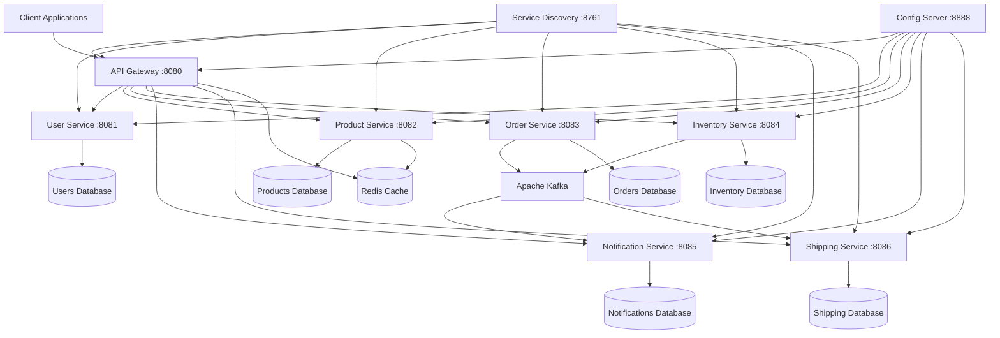
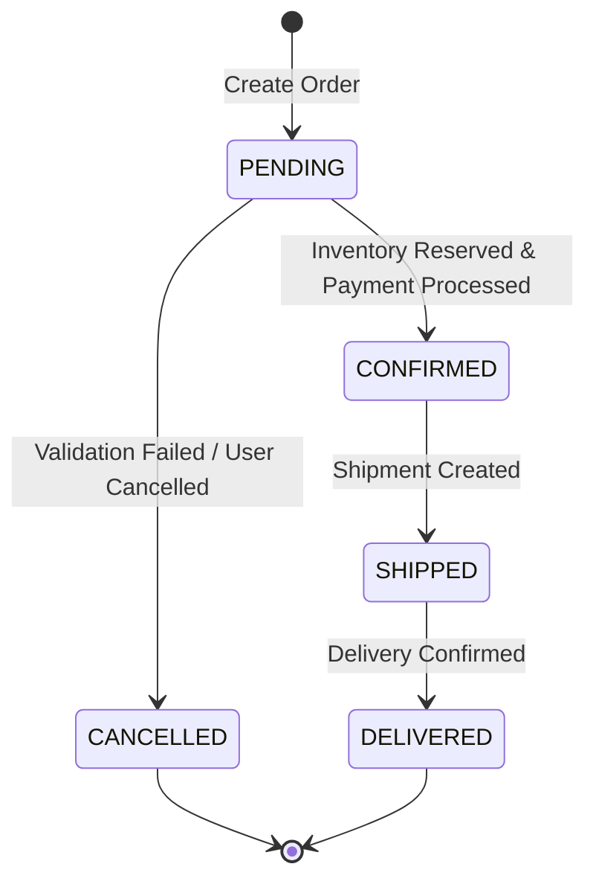
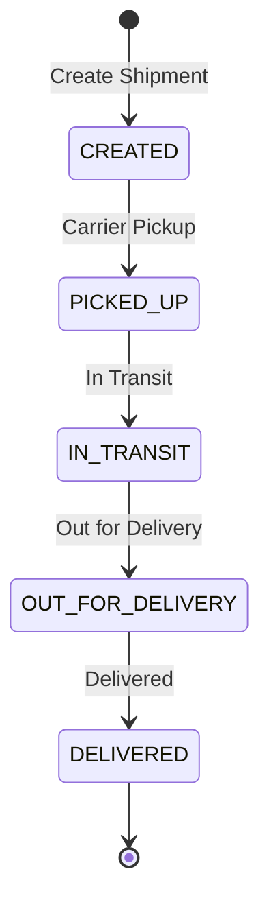

# 🚀 Smart Order Management System (SOMS)

> **A comprehensive microservices-based e-commerce order management platform built with Spring Boot, demonstrating enterprise-grade architecture patterns, event-driven communication, and modern development practices.**

[](https://openjdk.java.net/projects/jdk/17/)
[](https://spring.io/projects/spring-boot)
[](https://spring.io/projects/spring-cloud)
[](https://www.postgresql.org/)
[](https://kafka.apache.org/)
[](https://www.docker.com/)
[](LICENSE)

---

## 📋 Table of Contents

- [🎯 Project Overview](#-project-overview)
- [🏗️ Architecture Deep Dive](#️-architecture-deep-dive)
- [📁 Project Structure](#-project-structure)
- [🧩 Service Details](#-service-details)
- [🛠️ Technology Stack](#️-technology-stack)
- [🚀 Getting Started](#-getting-started)
- [⚙️ Configuration Guide](#️-configuration-guide)
- [🔧 Development Workflow](#-development-workflow)
- [🧪 Testing Strategy](#-testing-strategy)
- [🐳 Docker & Infrastructure](#-docker--infrastructure)
- [📊 Database Design](#-database-design)
- [⚡ Event-Driven Architecture](#-event-driven-architecture)
- [🔒 Security Implementation](#-security-implementation)
- [📈 Monitoring & Observability](#-monitoring--observability)
- [🚀 Deployment Guide](#-deployment-guide)
- [🔍 Troubleshooting](#-troubleshooting)
- [📚 Learning Resources](#-learning-resources)
- [🤝 Contributing](#-contributing)

---

## 🎯 Project Overview

### What is SOMS?

The **Smart Order Management System (SOMS)** is a production-ready microservices application that simulates a real-world e-commerce order processing system. It demonstrates modern enterprise architecture patterns and serves as both a learning platform and a showcase of microservices best practices.

### 🎪 Key Features

- ✅ **Real-time Order Processing** - Instant order validation and processing with inventory checks
- ✅ **Event-Driven Architecture** - Asynchronous communication using Apache Kafka
- ✅ **Microservices Pattern** - 9 independent services with clear boundaries
- ✅ **Service Discovery** - Dynamic service registration and discovery with Eureka
- ✅ **API Gateway** - Centralized request routing, authentication, and rate limiting
- ✅ **Distributed Security** - JWT-based authentication across all services
- ✅ **Real-time Notifications** - Email/SMS notifications for order status changes
- ✅ **Inventory Management** - Real-time stock tracking with reservation system
- ✅ **Order Tracking** - Complete order lifecycle management
- ✅ **Admin Dashboard** - Comprehensive system monitoring and management
- ✅ **Containerized Deployment** - Full Docker support with docker-compose
- ✅ **Production-Ready** - Health checks, metrics, logging, and monitoring

### 🎯 Learning Objectives

This project teaches:
- **Microservices Architecture** patterns and best practices
- **Spring Boot & Spring Cloud** ecosystem
- **Event-Driven Design** with Apache Kafka
- **Database-per-Service** pattern implementation
- **API Gateway** and service mesh concepts
- **Distributed Systems** challenges and solutions
- **Container Orchestration** with Docker
- **CI/CD Pipeline** setup and automation
- **Monitoring & Observability** in distributed systems
- **Security** in microservices environments

---

## 🏗️ Architecture Deep Dive

### System Architecture



### 🔄 Request Flow

1. **Client Request** → API Gateway receives HTTP request
2. **Authentication** → Gateway validates JWT token with User Service
3. **Service Discovery** → Eureka resolves target service location
4. **Request Routing** → Gateway forwards request to appropriate microservice
5. **Business Logic** → Service processes request using domain logic
6. **Event Publishing** → Service publishes events to Kafka for async operations
7. **Database Operations** → Service persists data to its dedicated database
8. **Response** → Gateway aggregates and returns response to client

### 🏛️ Architecture Patterns Used

- **🔷 Microservices Pattern** - Decomposed by business capability
- **🔷 Database-per-Service** - Each service owns its data
- **🔷 API Gateway Pattern** - Single entry point for all clients
- **🔷 Service Discovery** - Dynamic service location resolution
- **🔷 Event Sourcing** - Event-driven state management
- **🔷 CQRS (Command Query Responsibility Segregation)** - Separate read/write models
- **🔷 Circuit Breaker** - Fault tolerance and resilience
- **🔷 Saga Pattern** - Distributed transaction management
- **🔷 Outbox Pattern** - Reliable event publishing

---

## 📁 Project Structure

### Root Directory Layout

```
smart-order-management-system/
├── 📁 infrastructure-services/          # Core infrastructure components
│   ├── 📁 config-server/               # Centralized configuration management
│   ├── 📁 eureka-server/               # Service discovery and registry
│   └── 📁 api-gateway/                 # Request routing and security gateway
├── 📁 business-services/               # Business logic services
│   ├── 📁 user-service/                # User authentication and management
│   ├── 📁 product-service/             # Product catalog management
│   ├── 📁 order-service/               # Order processing and lifecycle
│   ├── 📁 inventory-service/           # Stock and inventory management
│   ├── 📁 notification-service/        # Async notifications (email/SMS)
│   └── 📁 shipping-service/            # Shipment tracking and logistics
├── 📁 docker/                          # Docker configurations and scripts
│   ├── 📄 docker-compose.yml          # Infrastructure setup
│   └── 📄 init-databases.sql          # Database initialization
├── 📁 scripts/                         # Utility and automation scripts
├── 📄 pom.xml                         # Maven parent POM configuration
└── 📄 README.md                       # This comprehensive documentation
```

### Service Structure Template

Each service follows a consistent structure:

```
service-name/
├── 📁 src/
│   ├── 📁 main/
│   │   ├── 📁 java/com/pranav/soms/servicename/
│   │   │   ├── 📄 ServiceNameApplication.java      # Main Spring Boot application
│   │   │   ├── 📁 controller/                      # REST API endpoints
│   │   │   │   ├── 📄 ServiceController.java       # Main controller
│   │   │   │   └── 📄 AdminController.java         # Admin endpoints
│   │   │   ├── 📁 service/                         # Business logic layer
│   │   │   │   ├── 📄 ServiceImpl.java             # Service implementation
│   │   │   │   └── 📄 ValidationService.java       # Business validation
│   │   │   ├── 📁 repository/                      # Data access layer
│   │   │   │   └── 📄 ServiceRepository.java       # JPA repository
│   │   │   ├── 📁 model/                           # Domain entities
│   │   │   │   ├── 📄 Entity.java                  # JPA entity
│   │   │   │   └── 📄 ValueObject.java             # Value objects
│   │   │   ├── 📁 dto/                             # Data transfer objects
│   │   │   │   ├── 📄 RequestDto.java              # Request DTOs
│   │   │   │   └── 📄 ResponseDto.java             # Response DTOs
│   │   │   ├── 📁 config/                          # Configuration classes
│   │   │   │   ├── 📄 DatabaseConfig.java          # Database configuration
│   │   │   │   ├── 📄 SecurityConfig.java          # Security setup
│   │   │   │   └── 📄 KafkaConfig.java             # Kafka configuration
│   │   │   ├── 📁 event/                           # Event handling
│   │   │   │   ├── 📄 EventPublisher.java          # Event publishing
│   │   │   │   └── 📄 EventListener.java           # Event consumption
│   │   │   ├── 📁 exception/                       # Error handling
│   │   │   │   ├── 📄 GlobalExceptionHandler.java  # Global error handler
│   │   │   │   └── 📄 CustomExceptions.java        # Custom exceptions
│   │   │   └── 📁 security/                        # Security components
│   │   │       ├── 📄 JwtService.java              # JWT handling
│   │   │       └── 📄 AuthenticationFilter.java    # Auth filter
│   │   └── 📁 resources/
│   │       ├── 📄 application.yml                  # Service configuration
│   │       ├── 📄 bootstrap.yml                    # Bootstrap configuration
│   │       └── 📁 db/migration/                    # Database migrations
│   │           └── 📄 V1__Initial_schema.sql       # SQL migration scripts
│   └── 📁 test/                                    # Test code
│       └── 📁 java/com/pranav/soms/servicename/
│           ├── 📄 ServiceApplicationTests.java     # Integration tests
│           ├── 📁 controller/                      # Controller tests
│           ├── 📁 service/                         # Service layer tests
│           └── 📁 repository/                      # Repository tests
├── 📄 pom.xml                                     # Maven dependencies
├── 📄 Dockerfile                                  # Container configuration
└── 📄 README.md                                   # Service-specific docs
```

---

## 🧩 Service Details

### 🔧 Infrastructure Services

#### 1. 🏢 Config Server (Port: 8888)
**Purpose**: Centralized configuration management for all microservices

**Key Responsibilities**:
- Serves configuration files from Git repository or local file system
- Provides environment-specific configurations (dev, test, prod)
- Supports configuration refresh without service restart
- Manages sensitive configuration with encryption

**Technologies**:
- Spring Cloud Config Server
- Git integration for configuration versioning
- Spring Security for access control

**Configuration Structure**:
```
config/
├── application.yml              # Global configuration
├── application-dev.yml          # Development environment
├── application-prod.yml         # Production environment
├── user-service.yml            # User service specific
├── product-service.yml         # Product service specific
└── api-gateway.yml             # Gateway specific
```

#### 2. 🌐 Eureka Server (Port: 8761)
**Purpose**: Service discovery and registry for dynamic service location

**Key Responsibilities**:
- Service registration and deregistration
- Health monitoring of registered services
- Load balancing support through service instances
- Fault tolerance with peer-to-peer replication

**Technologies**:
- Netflix Eureka Server
- Spring Cloud Netflix
- Health check integration

**Service Registration Process**:
1. Service starts and registers with Eureka
2. Eureka maintains heartbeat with service
3. Other services discover via Eureka client
4. Load balancing across multiple instances

#### 3. 🚪 API Gateway (Port: 8080)
**Purpose**: Single entry point for all client requests with routing and security

**Key Responsibilities**:
- Request routing to appropriate microservices
- Authentication and authorization
- Rate limiting and throttling
- Request/response transformation
- Circuit breaker implementation
- Logging and monitoring

**Technologies**:
- Spring Cloud Gateway
- JWT authentication
- Redis for rate limiting
- Circuit breaker pattern

**Routing Configuration**:
```yaml
spring:
  cloud:
    gateway:
      routes:
        - id: user-service
          uri: lb://user-service
          predicates:
            - Path=/api/auth/**,/api/users/**
          filters:
            - name: AuthenticationFilter
        - id: product-service
          uri: lb://product-service
          predicates:
            - Path=/api/products/**
```

### 💼 Business Services

#### 4. 👤 User Service (Port: 8081)
**Purpose**: User authentication, authorization, and profile management

**Key Responsibilities**:
- User registration and login
- JWT token generation and validation
- Password encryption and security
- Role-based access control (RBAC)
- User profile management
- Account activation and password reset

**Technologies**:
- Spring Security
- JWT (JSON Web Tokens)
- BCrypt password encryption
- PostgreSQL for user data

**Database Schema**:
```sql
CREATE TABLE users (
    id BIGSERIAL PRIMARY KEY,
    username VARCHAR(50) UNIQUE NOT NULL,
    email VARCHAR(100) UNIQUE NOT NULL,
    password VARCHAR(255) NOT NULL,
    first_name VARCHAR(50),
    last_name VARCHAR(50),
    role VARCHAR(20) DEFAULT 'USER',
    enabled BOOLEAN DEFAULT true,
    created_at TIMESTAMP DEFAULT CURRENT_TIMESTAMP,
    updated_at TIMESTAMP DEFAULT CURRENT_TIMESTAMP
);
```

**API Endpoints**:
- `POST /api/auth/register` - User registration
- `POST /api/auth/login` - User authentication
- `GET /api/users/profile` - Get user profile
- `PUT /api/users/profile` - Update user profile

#### 5. 📦 Product Service (Port: 8082)
**Purpose**: Product catalog management and search functionality

**Key Responsibilities**:
- Product CRUD operations
- Category management
- Product search and filtering
- Inventory status integration
- Price management
- Product image handling

**Technologies**:
- Spring Data JPA
- Redis caching
- PostgreSQL for product data
- Elasticsearch for search (optional)

**Database Schema**:
```sql
CREATE TABLE categories (
    id BIGSERIAL PRIMARY KEY,
    name VARCHAR(100) NOT NULL,
    description TEXT,
    created_at TIMESTAMP DEFAULT CURRENT_TIMESTAMP
);

CREATE TABLE products (
    id BIGSERIAL PRIMARY KEY,
    name VARCHAR(200) NOT NULL,
    description TEXT,
    price DECIMAL(10,2) NOT NULL,
    category_id BIGINT REFERENCES categories(id),
    sku VARCHAR(50) UNIQUE,
    active BOOLEAN DEFAULT true,
    created_at TIMESTAMP DEFAULT CURRENT_TIMESTAMP,
    updated_at TIMESTAMP DEFAULT CURRENT_TIMESTAMP
);
```

**API Endpoints**:
- `GET /api/products` - List products with pagination
- `GET /api/products/{id}` - Get product details
- `POST /api/products` - Create new product (Admin)
- `PUT /api/products/{id}` - Update product (Admin)
- `DELETE /api/products/{id}` - Delete product (Admin)

#### 6. 🛒 Order Service (Port: 8083)
**Purpose**: Order processing, lifecycle management, and workflow orchestration

**Key Responsibilities**:
- Order creation and validation
- Order status management (PENDING → CONFIRMED → SHIPPED → DELIVERED)
- Integration with inventory service
- Payment processing coordination
- Order history and tracking
- Saga pattern implementation for distributed transactions

**Technologies**:
- Spring Data JPA
- Apache Kafka for events
- OpenFeign for service communication
- PostgreSQL for order data

**Order Lifecycle**:


**Database Schema**:
```sql
CREATE TABLE orders (
    id BIGSERIAL PRIMARY KEY,
    user_id BIGINT NOT NULL,
    status VARCHAR(20) DEFAULT 'PENDING',
    total_amount DECIMAL(10,2) NOT NULL,
    shipping_address JSONB,
    created_at TIMESTAMP DEFAULT CURRENT_TIMESTAMP,
    updated_at TIMESTAMP DEFAULT CURRENT_TIMESTAMP
);

CREATE TABLE order_items (
    id BIGSERIAL PRIMARY KEY,
    order_id BIGINT REFERENCES orders(id),
    product_id BIGINT NOT NULL,
    quantity INTEGER NOT NULL,
    unit_price DECIMAL(10,2) NOT NULL,
    total_price DECIMAL(10,2) NOT NULL
);
```

#### 7. 📊 Inventory Service (Port: 8084)
**Purpose**: Real-time inventory management and stock operations

**Key Responsibilities**:
- Stock level tracking
- Inventory reservation system
- Stock movement logging
- Low stock alerts
- Optimistic locking for concurrent updates
- Integration with order and product services

**Technologies**:
- Spring Data JPA
- Redis for caching
- Apache Kafka for events
- PostgreSQL for inventory data

**Key Features**:
- **Optimistic Locking**: Prevents overselling
- **Reservation System**: Temporary stock holds during order processing
- **Audit Trail**: Complete history of stock movements

**Database Schema**:
```sql
CREATE TABLE inventory (
    id BIGSERIAL PRIMARY KEY,
    product_id BIGINT UNIQUE NOT NULL,
    available_quantity INTEGER NOT NULL DEFAULT 0,
    reserved_quantity INTEGER NOT NULL DEFAULT 0,
    total_quantity INTEGER NOT NULL DEFAULT 0,
    version BIGINT DEFAULT 0,  -- For optimistic locking
    updated_at TIMESTAMP DEFAULT CURRENT_TIMESTAMP
);

CREATE TABLE stock_movements (
    id BIGSERIAL PRIMARY KEY,
    product_id BIGINT NOT NULL,
    movement_type VARCHAR(20) NOT NULL, -- IN, OUT, RESERVED, RELEASED
    quantity INTEGER NOT NULL,
    reference_id VARCHAR(100), -- Order ID, Purchase ID, etc.
    created_at TIMESTAMP DEFAULT CURRENT_TIMESTAMP
);
```

#### 8. 📧 Notification Service (Port: 8085)
**Purpose**: Asynchronous notification handling via multiple channels

**Key Responsibilities**:
- Email notification processing
- SMS notification handling
- Push notification support
- Template management
- Delivery status tracking
- Event-driven notification triggers

**Technologies**:
- Spring Mail
- Thymeleaf templates
- Apache Kafka consumers
- Twilio for SMS
- PostgreSQL for notification logs

**Notification Types**:
- Order confirmation emails
- Shipping notifications
- Delivery confirmations
- Low stock alerts
- Account activation emails

**Event Processing**:
```java
@KafkaListener(topics = "order-events")
public void handleOrderEvent(OrderEvent event) {
    switch (event.getType()) {
        case ORDER_CREATED:
            sendOrderConfirmationEmail(event);
            break;
        case ORDER_SHIPPED:
            sendShippingNotification(event);
            break;
        case ORDER_DELIVERED:
            sendDeliveryConfirmation(event);
            break;
    }
}
```

#### 9. 🚚 Shipping Service (Port: 8086)
**Purpose**: Shipment tracking and logistics management

**Key Responsibilities**:
- Shipment creation and tracking
- Carrier integration (FedEx, UPS, DHL)
- Delivery status updates
- Route optimization
- Shipping cost calculation
- Delivery time estimation

**Technologies**:
- Spring Data JPA
- Apache Kafka for events
- External carrier APIs
- PostgreSQL for shipment data

**Shipment Lifecycle**:


---

## 🛠️ Technology Stack

### Core Technologies

| Component | Technology | Version | Purpose |
|-----------|------------|---------|---------|
| **Language** | Java | 17 | Main programming language |
| **Framework** | Spring Boot | 3.2.0 | Application framework |
| **Cloud** | Spring Cloud | 2023.0.0 | Microservices infrastructure |
| **Build Tool** | Maven | 3.9+ | Dependency management and build |

### Spring Boot Ecosystem

| Component | Technology | Usage |
|-----------|------------|-------|
| **Web** | Spring Web MVC | REST API development |
| **Data** | Spring Data JPA | Database abstraction |
| **Security** | Spring Security | Authentication & authorization |
| **Cloud Gateway** | Spring Cloud Gateway | API Gateway implementation |
| **Config** | Spring Cloud Config | Centralized configuration |
| **Discovery** | Netflix Eureka | Service discovery |
| **Circuit Breaker** | Resilience4j | Fault tolerance |

### Data Layer

| Component | Technology | Version | Purpose |
|-----------|------------|---------|---------|
| **Database** | PostgreSQL | 13 | Primary data storage |
| **Cache** | Redis | 7 | Caching and session storage |
| **Message Broker** | Apache Kafka | Latest | Event streaming |
| **Search** | Elasticsearch | 8.x | Product search (optional) |

### Infrastructure & DevOps

| Component | Technology | Version | Purpose |
|-----------|------------|---------|---------|
| **Containerization** | Docker | Latest | Application packaging |
| **Orchestration** | Docker Compose | Latest | Local development |
| **Monitoring** | Prometheus | Latest | Metrics collection |
| **Visualization** | Grafana | Latest | Metrics dashboard |
| **Logging** | ELK Stack | Latest | Centralized logging |
| **Tracing** | Zipkin | Latest | Distributed tracing |

### Security & Authentication

| Component | Technology | Purpose |
|-----------|------------|---------|
| **Authentication** | JWT (JSON Web Tokens) | Stateless authentication |
| **Password Encryption** | BCrypt | Secure password hashing |
| **HTTPS/TLS** | SSL Certificates | Secure communication |
| **CORS** | Spring Security CORS | Cross-origin request handling |

---

## 🚀 Getting Started

### Prerequisites

Before starting, ensure you have the following installed:

- ☑️ **Java 17+** - [Download OpenJDK](https://openjdk.java.net/projects/jdk/17/)
- ☑️ **Maven 3.8+** - [Installation Guide](https://maven.apache.org/install.html)
- ☑️ **Docker Desktop** - [Get Docker](https://docs.docker.com/get-docker/)
- ☑️ **Git** - [Download Git](https://git-scm.com/downloads)
- ☑️ **IDE** - IntelliJ IDEA, Eclipse, or VS Code

### Quick Start Guide

#### Step 1: Clone and Setup Project

```bash
# Clone the repository
git clone https://github.com/your-username/smart-order-management-system.git
cd smart-order-management-system

# Verify project structure
tree -L 2
```

#### Step 2: Start Infrastructure Services

```bash
# Navigate to docker directory
cd docker

# Start all infrastructure (PostgreSQL, Redis, Kafka)
docker compose up -d

# Verify all containers are running
docker compose ps
```

Expected output:
```
NAME            IMAGE                             STATUS
soms-postgres   postgres:13-alpine               Up
soms-redis      redis:7-alpine                   Up
soms-kafka      confluentinc/cp-kafka:latest     Up
soms-zookeeper  confluentinc/cp-zookeeper:latest Up
soms-kafka-ui   provectuslabs/kafka-ui:latest    Up
soms-adminer    adminer:latest                   Up
```

#### Step 3: Build All Services

```bash
# Navigate back to root directory
cd ..

# Build all services (skip tests for quick start)
mvn clean install -DskipTests

# Verify build success
# You should see "BUILD SUCCESS" for all 9 services
```

#### Step 4: Start Services in Order

**Terminal 1 - Config Server:**
```bash
cd infrastructure-services/config-server
mvn spring-boot:run
```
Wait for: `Started ConfigServerApplication on port 8888`

**Terminal 2 - Eureka Server:**
```bash
cd infrastructure-services/eureka-server
mvn spring-boot:run
```
Wait for: `Started EurekaServerApplication on port 8761`

**Terminal 3 - API Gateway:**
```bash
cd infrastructure-services/api-gateway
mvn spring-boot:run
```
Wait for: `Started ApiGatewayApplication on port 8080`

**Terminal 4 - User Service:**
```bash
cd business-services/user-service
mvn spring-boot:run
```
Wait for: `Started UserServiceApplication on port 8081`

**Terminal 5 - Product Service:**
```bash
cd business-services/product-service
mvn spring-boot:run
```
Wait for: `Started ProductServiceApplication on port 8082`

#### Step 5: Verify System Health

**Check Service Discovery:**
```bash
# Visit Eureka Dashboard
open http://localhost:8761
```

**Check API Gateway:**
```bash
# Test gateway health
curl http://localhost:8080/actuator/health
```

**Check Database:**
```bash
# Access Adminer (Database UI)
open http://localhost:8091
# Server: postgres:5432
# Username: soms_user
# Password: soms_password
```

**Check Kafka:**
```bash
# Access Kafka UI
open http://localhost:8090
```

#### Step 6: Test the System

**Register a User:**
```bash
curl -X POST http://localhost:8080/api/auth/register \
  -H "Content-Type: application/json" \
  -d '{
    "username": "testuser",
    "email": "test@example.com",
    "password": "password123",
    "firstName": "Test",
    "lastName": "User"
  }'
```

**Login:**
```bash
curl -X POST http://localhost:8080/api/auth/login \
  -H "Content-Type: application/json" \
  -d '{
    "username": "testuser",
    "password": "password123"
  }'
```

**Save the JWT token from response for subsequent requests.**

---

## ⚙️ Configuration Guide

### Environment Configuration

Each service can be configured for different environments:

#### application.yml (Global Configuration)
```yaml
# Global settings applied to all services
spring:
  profiles:
    active: ${SPRING_PROFILES_ACTIVE:dev}
  
  datasource:
    driver-class-name: org.postgresql.Driver
    hikari:
      connection-timeout: 20000
      maximum-pool-size: 10
      minimum-idle: 5

eureka:
  client:
    service-url:
      defaultZone: ${EUREKA_SERVER_URL:http://localhost:8761/eureka/}

management:
  endpoints:
    web:
      exposure:
        include: health,info,metrics,prometheus
  endpoint:
    health:
      show-details: always
```

#### Service-Specific Configuration

**User Service (user-service.yml):**
```yaml
server:
  port: 8081

spring:
  application:
    name: user-service
  datasource:
    url: jdbc:postgresql://localhost:5432/soms_users
    username: ${DB_USERNAME:soms_user}
    password: ${DB_PASSWORD:soms_password}
  
  jpa:
    hibernate:
      ddl-auto: update
    show-sql: false

jwt:
  secret: ${JWT_SECRET:your-256-bit-secret-key-here}
  expiration: ${JWT_EXPIRATION:86400000} # 24 hours

logging:
  level:
    com.pranav.soms.user: DEBUG
```

**API Gateway (api-gateway.yml):**
```yaml
server:
  port: 8080

spring:
  application:
    name: api-gateway
  cloud:
    gateway:
      routes:
        - id: user-service
          uri: lb://user-service
          predicates:
            - Path=/api/auth/**,/api/users/**
          filters:
            - name: AuthenticationFilter
        - id: product-service
          uri: lb://product-service
          predicates:
            - Path=/api/products/**
      globalcors:
        cors-configurations:
          '[/**]':
            allowed-origins: "*"
            allowed-methods: "*"
            allowed-headers: "*"
```

### Environment Variables

Key environment variables for configuration:

```bash
# Database Configuration
export DB_HOST=localhost
export DB_PORT=5432
export DB_USERNAME=soms_user
export DB_PASSWORD=soms_password

# JWT Configuration
export JWT_SECRET=your-secure-256-bit-secret-key-here
export JWT_EXPIRATION=86400000

# Kafka Configuration
export KAFKA_BOOTSTRAP_SERVERS=localhost:9092

# Redis Configuration
export REDIS_HOST=localhost
export REDIS_PORT=6379

# Service Discovery
export EUREKA_SERVER_URL=http://localhost:8761/eureka

# Environment
export SPRING_PROFILES_ACTIVE=dev
```

---

## 🔧 Development Workflow

### Daily Development Process

#### 1. Start Development Environment

```bash
# Start infrastructure
cd docker && docker compose up -d

# Start core services
./scripts/start-core-services.sh

# Or start manually in order:
# 1. Config Server (8888)
# 2. Eureka Server (8761)  
# 3. API Gateway (8080)
```

#### 2. Service Development

**When working on a specific service:**

```bash
# Example: Working on Product Service
cd business-services/product-service

# Make your changes to the code
# ...

# Run tests
mvn test

# Start service in development mode
mvn spring-boot:run -